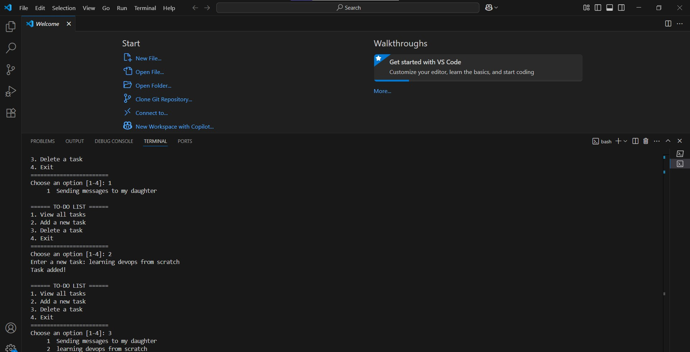
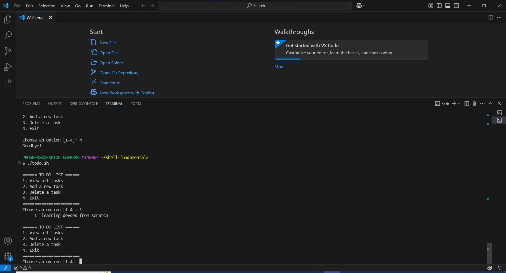
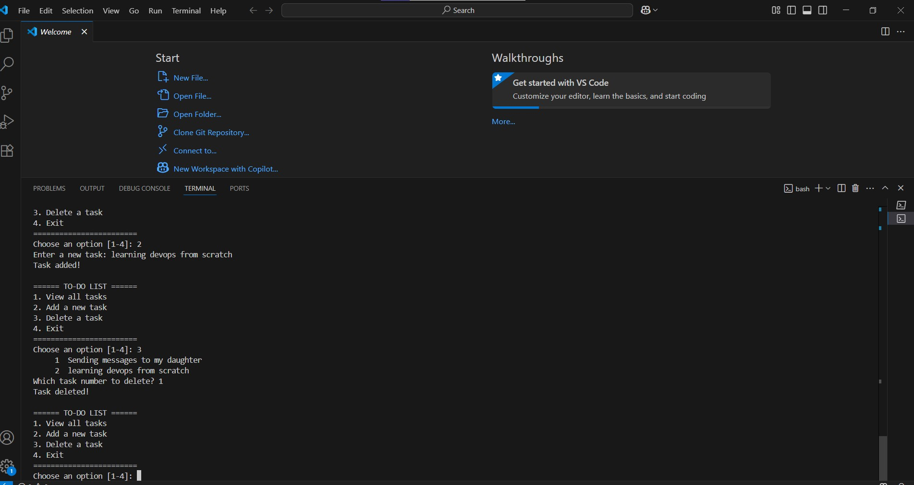
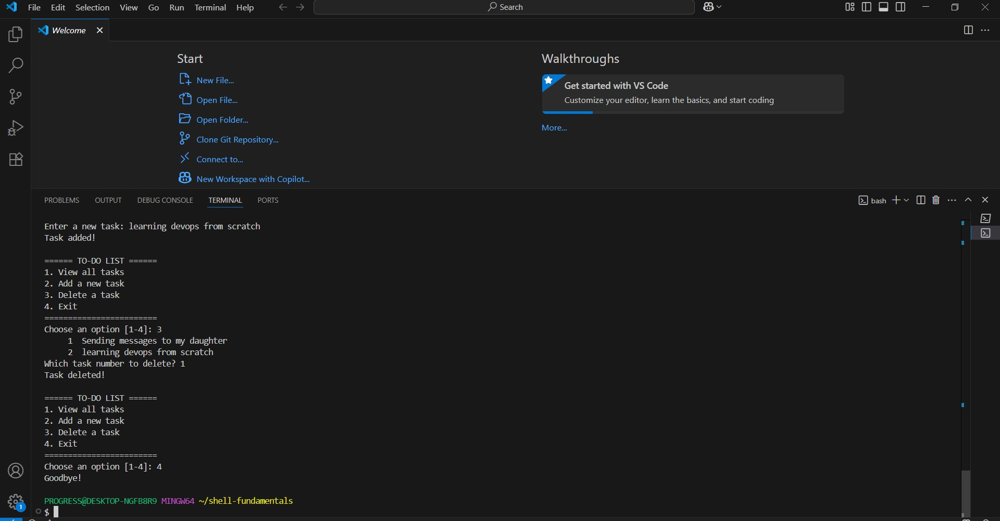

# shell-fundamentals

This screenshot above shows the process of adding task to the todo list

This screenshot above shows all the task that has been addd to the todo list

This screenshot above shows the task that has been deleted from the todo list

This screenshot above shows the task that was exited from the list

